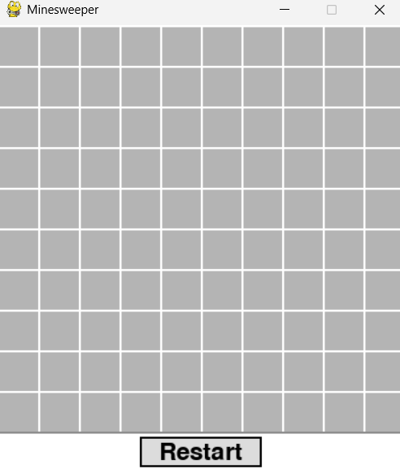
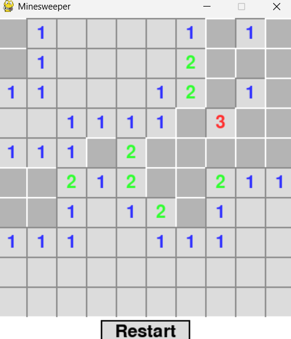
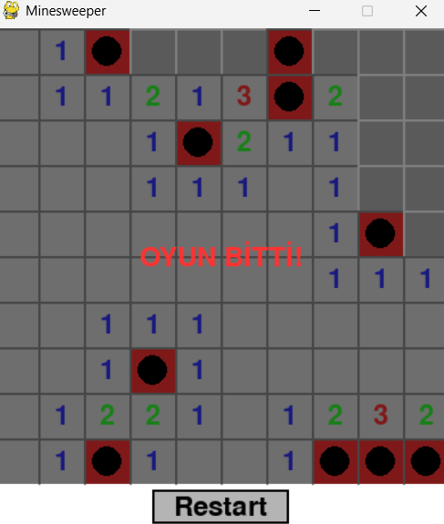

# Python Minefield

Pygame kullanılarak Python ile geliştirilmiş klasik bir Minefield (Mayın Tarlası) oyunu.

## Uygulama Görselleri
|               Başlangıç              |              Oyun İçi Görüntü             |          Mayına Basma Fonksiyonu         |
| :----------------------------------: | :---------------------------------------: |:---------------------------------------: |
|                  |                      |                     |

## Gereksinimler

- Python 3.x
- Pygame

## Kurulum

1. Bu depoyu klonlayın veya dosyaları indirin.
2. Gerekli bağımlılıkları yüklemek için aşağıdaki komutu çalıştırın:
```bash
pip install -r requirements.txt
```

## Nasıl Oynanır?

1. Oyunu başlatmak için:
```bash  
python minefield.py
```

2. Oyun Kontrolleri:
- Sol Tık: Hücreyi aç
- Sağ Tık: Bayrak koy / kaldır
- R Tuşu: Oyunu sıfırla

3. Oyun Kuralları:
- Oyun alanı 10x10’luk bir ızgaradan oluşur ve 10 adet mayın içerir.
- Hücrelerdeki sayılar, çevresinde kaç mayın olduğunu gösterir.
- Bu sayılara göre mayınların yerlerini tahmin edin.
- Mayın olduğunu düşündüğünüz hücrelere bayrak yerleştirin.
- Tüm mayınsız hücreleri açarsanız oyunu kazanırsınız.
- Bir mayına tıklarsanız oyunu kaybedersiniz!

## Özellikler
- Klasik Minefield oynanışı
- Açılan hücreler ve bayraklar için görsel geri bildirim
- Kazanma ve kaybetme durumları
- Kolay oyun sıfırlama özelliği
- Temiz ve kullanıcı dostu arayüz 
